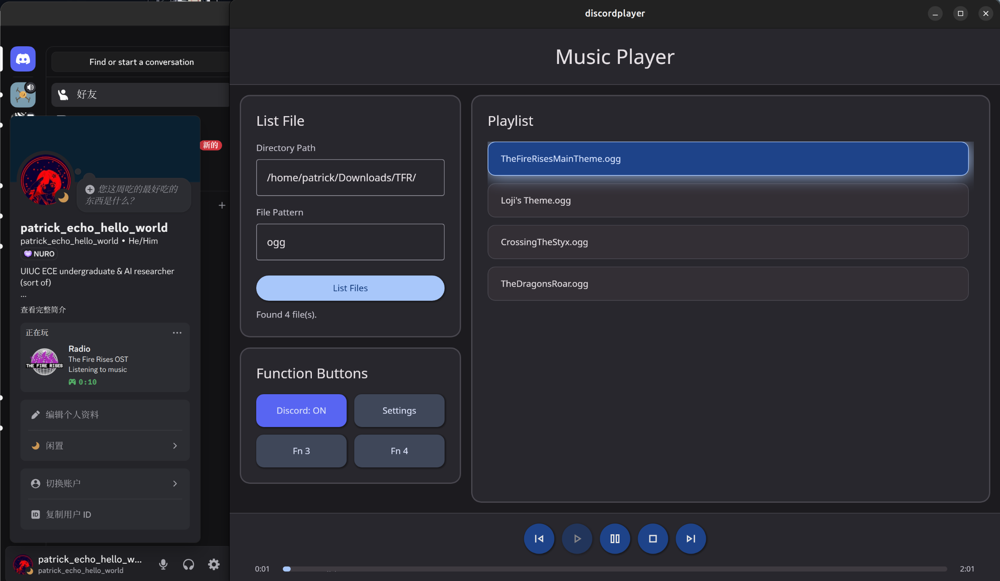

# Discord Player

  
<h3 align="center">Discord Player</h3>

A music player that can connect to Discord.

## Install
1. Download built binary if you don't want to build from source (will be there later)
2. If you want to build from source, make sure you have `nodejs`, `pnpm` and  [Tauri V2.0 and its dependency](https://v2.tauri.app/start/prerequisites/) installed properly.
3. Clone the repo, cd into it and run `pnpm install`, then run `pnpm tauri build`. You should then find built binaries in `src-tauri/target/release/bundle`

## How to use

1. Get yourself a discord app, remember the client ID of your app.
2. Upload the cover of your album in that app's `Rich Peresence` page. You may see discord update the name of your image after uploading, remember the updated file name.
3. Rename your cover image to discord's version, then put it to directory root of your album
4. Create a `details.txt` in your album's directory root, then write something to describe your album there.
5. Launch the app. Go to "Settings" and fill in your app's client ID.
6. Go back, enter path to your album and format of audio file (like "wav". No wildcard support)
7. Press Discord: OFF button, then your album cover and description will show up in discord!